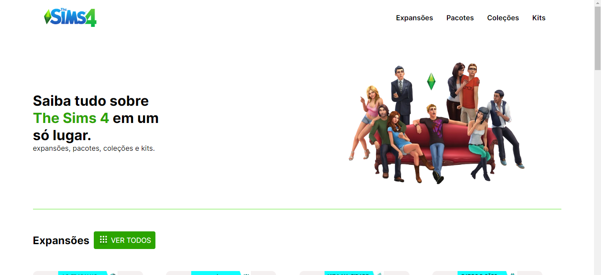

# Welcome

## 📖 Resumo do projeto

- Criado em 21/01/2024

- Este é um projeto que foi desenvolvido para praticar HTML e CSS. Gosto muito de jogar The Sims 4, então resolvi criar um site mostrando todas as expansões, kits, pacotes e coleções do jogo.

## 💻 Funcionalidades do projeto

- Funcionalidade: Este é um site para mostrar todas as expansões, kits, coleções e pacotes do jogo. 

## 👨🏽‍💻 Tecnologias utilizadas

- HTML5
- CSS3 (flexbox, grid, Media Queries)

## Design
